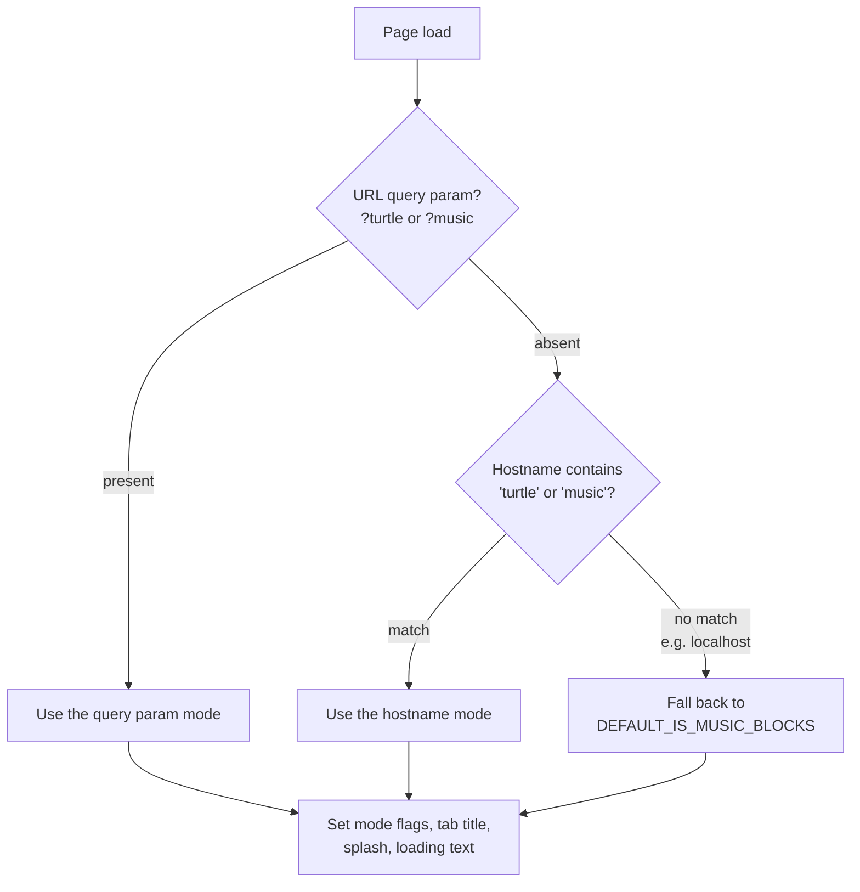
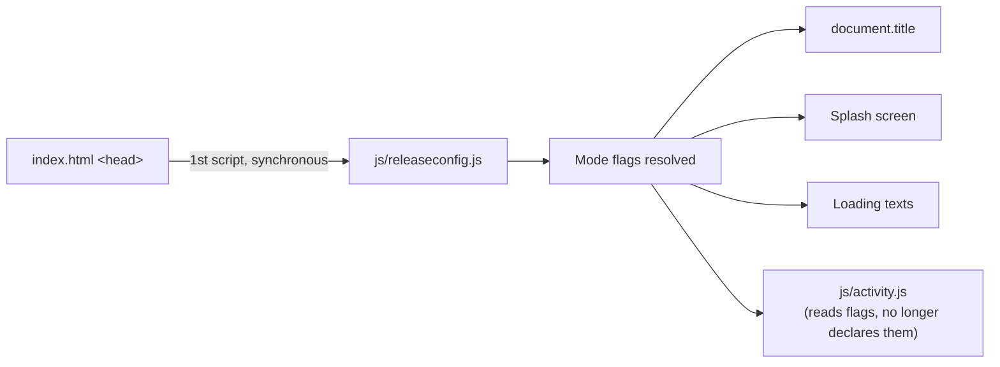

# Week 7 Progress Report by Sonal Gaud

**Project:** Automated Release Pipeline for Music Blocks  
**Mentors:** [Walter Bender](https://github.com/walterbender), [Om Santosh Suneri](https://github.com/omsuneri)  
**Organization:** [Sugar Labs](https://sugarlabs.org)  
**Reporting Period:** 2026-07-06 - 2026-07-12  

---

## Overview

After the refinements from [Week 6](/news/all/2026-07-05-gsoc-26-sonal-gaud-week6), this week the release-configuration work was consolidated into its final home: the Music Blocks repository. The goal of this effort, assigned by Walter, is to have a **single repository carry the code of both Turtle Blocks and Music Blocks**, with runtime detection deciding which app the user sees, a concrete step toward retiring the standalone `turtleblocksjs` repository entirely. The work is tracked in [sugarlabs/musicblocks#7908](https://github.com/sugarlabs/musicblocks/pull/7908).

This post is written to double as documentation for the approach: what problem the unification solves, how the mode-resolution logic is designed, why it is wired into the page the way it is, and what trade-offs were made along the way. Anyone reading this later (a new contributor, a reviewer, or future me) should be able to understand the shared-release setup from this post alone.

---

## The Problem: Two Repositories, One Codebase's Worth of Logic

Historically, Turtle Blocks and Music Blocks have lived in separate repositories even though they share the overwhelming majority of their code. Music Blocks itself grew out of Turtle Blocks, the block-based programming model, the palette system, the project loading and saving machinery, and the rendering pipeline are common to both. What actually differs between the two apps is comparatively tiny:

- **Identity:** the name in the browser tab, the splash artwork shown during initialization, and the loading texts.
- **Feature surface:** which palettes are exposed, Music Blocks layers the music-specific palettes (rhythm, pitch, tone, and so on) on top of the shared turtle-graphics core.
- **A pair of global flags:** `THIS_IS_MUSIC_BLOCKS` and `THIS_IS_TURTLE_BLOCKS`, declared and hardcoded per repository inside `js/activity.js`, which the rest of the code consults to decide behavior.

Everything else was duplicated. And duplication between two actively developed repositories is not a static cost, it compounds. A bug fixed in `musicblocks` had to be manually ported to `turtleblocksjs`, and in practice the ports lagged or never happened, so the repositories drifted. For this GSoC project specifically, the drift is a blocker: an **automated release pipeline cannot reasonably target two diverging codebases**. Every workflow, building, testing, versioning, packaging, deploying, would need to exist twice and be kept in sync by hand, which is exactly the kind of manual coordination the pipeline is meant to eliminate.

The fix is conceptually simple: make the app's identity a **runtime decision** instead of a repository decision. Build one codebase, deploy it everywhere, and let each deployment resolve which app it is when the page loads.

---

## The Solution: `js/releaseconfig.js` as the Single Source of Truth

The new `js/releaseconfig.js` file owns everything release-mode related. All the mode logic that used to be scattered, the hardcoded flags in `activity.js`, the hardcoded `<title>`, the splash selection, now flows from this one file. It resolves which app to present through three tiers, checked in strict order, where the first tier that produces an answer wins:

Each tier serves a distinct audience:

**Tier 1: the URL query parameter (`?turtle` / `?music`).** This is the developer-facing override. A contributor running the app on `localhost` can flip between the two apps instantly by editing the URL, with no code changes, no separate checkout, and no rebuild. It also deliberately outranks the hostname, so even on a production deployment you can force the other mode for debugging.

**Tier 2: the hostname.** This is what production relies on. The Turtle Blocks site and the Music Blocks site will serve *byte-identical* code; the only difference is the domain the user typed. If the hostname contains "turtle", the page resolves to Turtle Blocks; if it contains "music", to Music Blocks. This is the property that makes the release pipeline clean: one build artifact, two deployments, zero build-time branching.

**Tier 3: the default fallback.** `DEFAULT_IS_MUSIC_BLOCKS` covers `localhost` and any unrecognized host. Per the decision documented in Week 6, the default is Music Blocks mode, which matches both the primary development workflow and the direction of the project.

An important design property of this ordering: it is *deterministic and inspectable*. Given a URL, you can predict the mode without reading any other file, and the resolution happens in one place rather than being re-derived by different modules in different ways.

---

## Wiring It Into the Page

Deciding the mode is only half the job, the decision has to land *before* anything that depends on it runs. That is why `releaseconfig.js` is loaded **synchronously as the very first script in the `<head>` of `index.html`**. Synchronous loading is normally something to avoid for performance, but here it is the correct tool: the file is tiny, it has no dependencies, and every later script must be able to assume the mode flags already exist. Loading it async or deferred would create a race where early code reads an undefined flag.

With the flag resolved first, it now drives three things that used to be hardcoded:

- **`document.title`**, set from `RELEASE_TAB_TITLE` instead of a literal string in the HTML, so the browser tab reads "Turtle Blocks" or "Music Blocks" as appropriate for the resolved mode.
- **The splash screen**, the initialization artwork swaps based on mode. The locale-specific handling from Week 6 sits on top of this: the normalized `ja` / `ja-*` check still selects the Japanese splash variant where applicable.
- **The loading texts**, the messages shown while the app initializes follow the same flag, so the whole first-load experience is consistent with the chosen identity.

The cleanup half of the change is just as important as the additions. The duplicate `THIS_IS_MUSIC_BLOCKS` / `THIS_IS_TURTLE_BLOCKS` declarations were **removed from `js/activity.js`**. Those globals are now declared and owned exclusively by `releaseconfig.js`. This was not optional tidiness, since the config file loads first, leaving the old declarations in `activity.js` would have caused a redeclaration conflict at runtime the moment both files loaded. Ownership had to move, not be shared.

The resulting mental model for contributors is a clean one-way flow: **URL/hostname → `releaseconfig.js` → flags → everything else.** No other file makes mode decisions; every other file only reads them.

---

## Why This Matters for the Release Pipeline

It is worth connecting this back to the overall project, because on its own this PR looks like a small refactor. The automated release pipeline being built this summer needs to produce versioned, verified releases of *both* apps. With the unified setup:

- **One CI matrix** tests the code both apps share, instead of two half-overlapping suites.
- **One build** produces the artifact for both deployments, there is no "Turtle build" and "Music build" to keep in lockstep.
- **One release tag** describes the state of both apps simultaneously, which makes changelogs and version history coherent.
- **Retiring `turtleblocksjs`** stops the drift permanently: future fixes land once and reach both apps by definition.

In other words, this PR converts a two-repository release problem into a one-repository release problem, and the rest of the pipeline is being designed against the one-repository shape.

---

## PR Link

PR: [sugarlabs/musicblocks#7908, refactor: centralize Turtle/Music release configuration](https://github.com/sugarlabs/musicblocks/pull/7908)

The PR is categorized as a chore/refactor with no intended behavior change for the default Music Blocks experience, the change is that Turtle Blocks now lives in the same place.

---

## Plans for Next Week

- Open the PR for mentor review and gather feedback.
- Test the mode switching end to end, query params, hostname resolution, and the splash/title/loading behavior in both modes.
- Address any edge cases the review surfaces, especially around how the new URL flags interact with the rest of the app's URL handling.

---

## Acknowledgements

Thank you to Walter Bender and Om Santosh Suneri for shaping the direction of this unification work and for their continued guidance.
