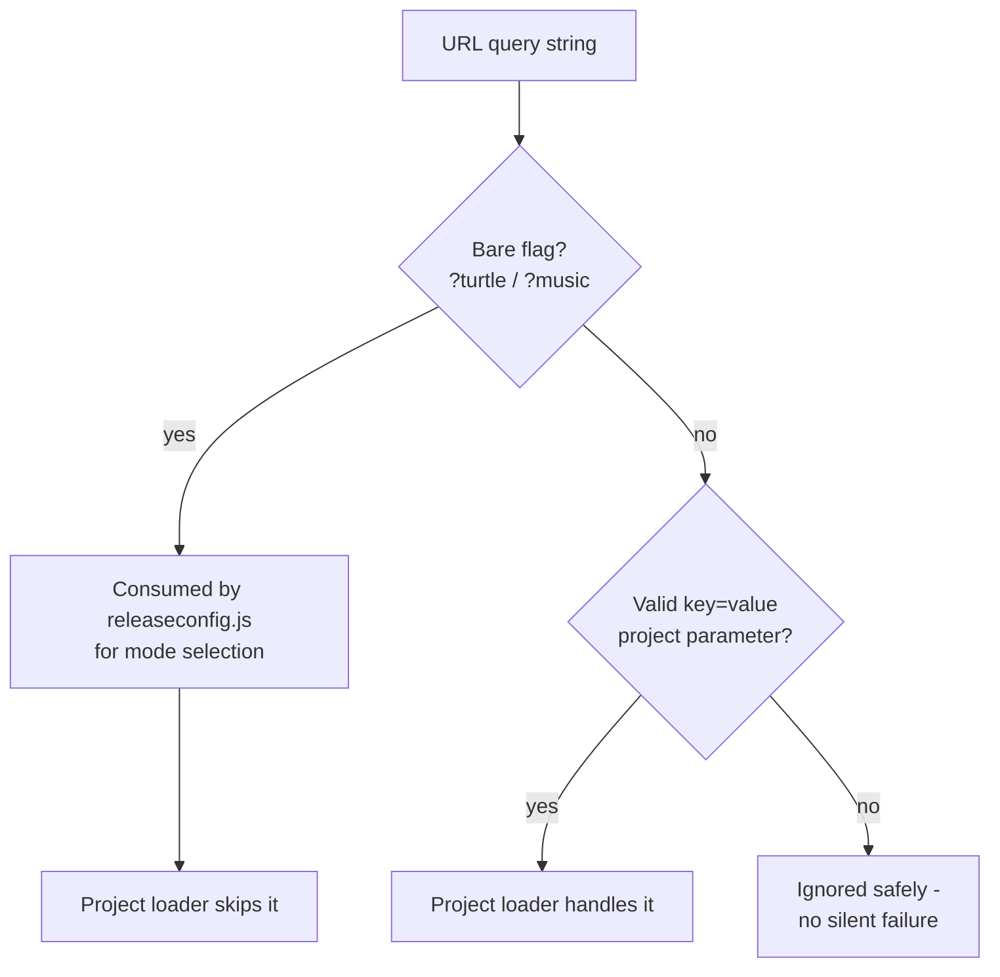
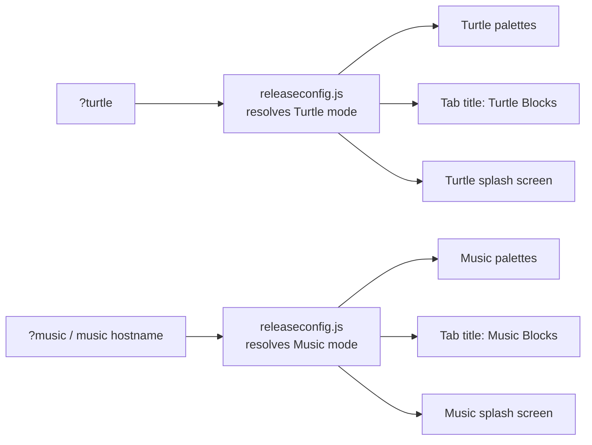

# Week 8 Progress Report by Sonal Gaud

**Project:** Automated Release Pipeline for Music Blocks  
**Mentors:** [Walter Bender](https://github.com/walterbender), [Om Santosh Suneri](https://github.com/omsuneri)  
**Organization:** [Sugar Labs](https://sugarlabs.org)  
**Reporting Period:** 2026-07-13 - 2026-07-19  

---

## Overview

[Week 7](/news/all/2026-07-12-gsoc-26-sonal-gaud-week7) landed the structure: `js/releaseconfig.js` as the single source of truth for Turtle vs. Music mode in [sugarlabs/musicblocks#7908](https://github.com/sugarlabs/musicblocks/pull/7908). This week was about making that structure actually hold up under real use, fixing a project-loading bug the new URL flags exposed, getting `?turtle` to switch the *entire* app rather than just its surface, documenting the flag behavior so reviewers can test it, and pinning the resolution logic down with automated tests.

With this, the Turtle Blocks task assigned by Walter is functionally complete: **a single repository now carries the code of both Turtle Blocks and Music Blocks**, and either app can be brought up from the same checkout with a URL change.

---

## Bug: Bare Flags Broke Project Loading

The most instructive part of the week was a bug that only appeared once the new flags met the rest of the app.

**Symptom.** Opening the app with `?music` or `?turtle` in the URL caused loading to **fail silently**, no error surfaced to the user, the app simply never finished coming up. A URL with no argument at all opened perfectly fine. Silent failures are the worst kind: nothing in the UI hints at what went wrong, so without checking the console you would just see a hung page.

**Root cause.** Music Blocks' project-manager also reads the URL query string, that is how features like loading a shared project from a link work. Its parsing path assumed every query parameter is a well-formed `key=value` pair and treated whatever it found as potential project-loading input. A bare flag like `?turtle` has a key but **no value**, which the parser had never had to handle before. It attempted to interpret the mode flag as project data, choked, and took the load sequence down with it, silently.

This is a classic integration hazard: `releaseconfig.js` and the project-manager are both correct in isolation, but they share the URL query string as an input namespace, and neither knew about the other's vocabulary.

**Fix.** The single-param parsing path in the project-manager is now guarded. Bare flags such as `?music` / `?turtle` are recognized as mode switches that belong to `releaseconfig.js` and are **explicitly ignored by the project loader**, which now only acts on genuine `key=value` project parameters. Anything else unrecognized is skipped safely instead of derailing the load:

The broader lesson recorded here for future contributors: **the URL query string is a shared, unowned namespace.** Any feature that adds a new parameter to it must audit every other consumer of `location.search`, because those consumers were written assuming a vocabulary that just changed. The mode flags are now part of that vocabulary, and the project loader tolerates them by design rather than by accident.

---

## Documenting the Flag Behavior

A fair and important review question came up during the week: *what should the flag look like, and how exactly do I test this?* A feature that only its author knows how to exercise is not reviewable, so the resolution behavior was documented directly in the PR:

- **Tier 1 (query param):** `?turtle` or `?music` forces the mode, overriding everything else. This tier exists primarily for local testing, e.g. `http://localhost:3000/?turtle` brings up Turtle Blocks on a dev server.
- **Tier 2 (hostname):** if the hostname contains "turtle" or "music", that substring picks the mode. This is what production relies on: both deployments serve identical code, and the domain alone decides the identity.
- **Tier 3 (fallback):** `DEFAULT_IS_MUSIC_BLOCKS` covers `localhost` and unrecognized hosts, defaulting to Music Blocks per the Week 6 decision.

The syntax question was also considered explicitly: should the flag be the bare `?turtle` / `?music`, or a single explicit parameter like `?app=turtle` / `?app=music`? The explicit form is more self-describing and trivially `key=value`-shaped, which would have sidestepped the parsing bug above. The bare-flag form is shorter and matches how the flags were already being discussed. For now the **bare-flag form was kept**, with the guard making it safe, and the `?app=` shape remains on the table if review prefers the explicit style, switching later is a small, contained change since only `releaseconfig.js` and the guard would move.

---

## Verifying the Full Mode Switch

Early in the week, `?turtle` changed some surface details but did not convincingly switch the whole app, which raised the right question from review: is this a rename, or a real mode? After the fixes, visiting `http://localhost:3000/?turtle` now brings up Turtle Blocks correctly **end to end**: the palette set, the browser tab title, and the splash screen all switch together, all driven by the one resolved flag rather than by separate checks that could disagree:

That "all driven by one flag" property is the whole point of the single-source-of-truth design. If the palettes switched but the title did not, it would mean some module was still making its own mode decision, a bug in the architecture, not just in the feature. Verifying that everything moves together is verifying the design.

Alongside the manual verification, **automated tests were added around the resolution logic** as part of addressing review feedback. The three-tier behavior, param beats hostname beats default, bare flags recognized, unrecognized hosts falling through, is now pinned down by tests rather than resting on manual checks that would inevitably be skipped in future PRs.

---

## Milestone: One Repository, Two Apps

With the parsing guard, the verified end-to-end mode switch, and the tests in place, the unification task is functionally done. Stepping back, here is what changed in structural terms:

- **Before:** two repositories, each hardcoding its identity, sharing most of their code by copy and drifting apart with every unported fix.
- **After:** one repository, one build, identity resolved at runtime from the URL or hostname. Turtle Blocks is now a *mode* of the Music Blocks codebase.

The `turtleblocksjs` repository no longer needs to carry its own diverging copy of the shared code, which clears the path toward retiring it. And this is exactly the shape the automated release pipeline needs: **one repository to build, test, version, and release, producing both apps from the same artifact.** Every subsequent piece of pipeline work (containerization, deploy verification, release tagging) gets simpler because it targets one codebase instead of two.

A couple of small follow-ups remain from review and will be handled as the PR moves toward merge: polishing the Turtle splash artwork, re-verifying the Japanese locale splash on top of the new mode logic, and removing an editor settings file that slipped into the diff.

---

## PR Link

PR: [sugarlabs/musicblocks#7908, refactor: centralize Turtle/Music release configuration](https://github.com/sugarlabs/musicblocks/pull/7908)

---

## Plans for Next Week

- Close out the remaining splash follow-ups and take the PR to merge.
- Shift focus to the server side of the pipeline: a `/healthz` health endpoint and graceful shutdown handling, preparing the ground for containerization and automated post-deploy verification.

---

## Acknowledgements

Thank you to Walter Bender and Om Santosh Suneri for the thorough hands-on testing that caught the bare-flag bug early, for pushing on the "how do I test this" question that made the flag behavior get documented properly, and for their continued guidance throughout this unification milestone.
