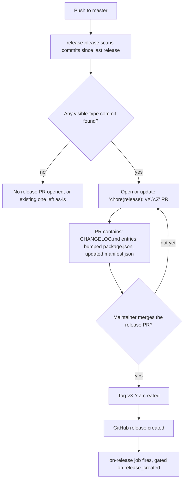
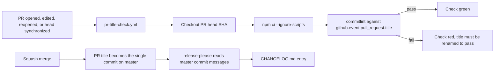
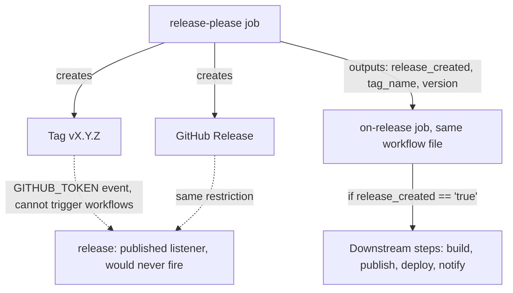
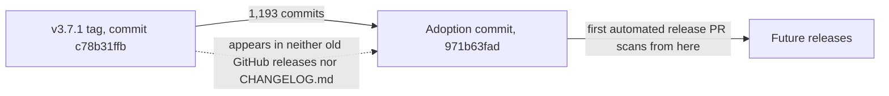
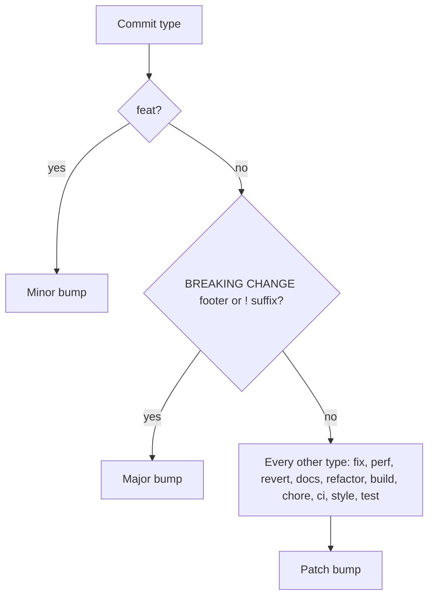

# Week 9 Progress Report by Sonal Gaud

**Project:** Automated Release Pipeline for Music Blocks  
**Mentors:** [Walter Bender](https://github.com/walterbender), [Om Santosh Suneri](https://github.com/omsuneri)  
**Organization:** [Sugar Labs](https://sugarlabs.org)  
**Reporting Period:** 2026-07-20 - 2026-07-26  

---

## Overview

[Week 8](/news/all/2026-07-19-gsoc-26-sonal-gaud-week8) closed out the Turtle/Music unification: one repository, runtime mode detection, `js/releaseconfig.js` verified end to end, palettes and title and splash all switching together off the one resolved flag. With the codebase unified, the next gap in the pipeline stood out clearly: Music Blocks had no automated way to produce a changelog or bump its own version. Ten tags had been cut by hand without the manifest being bumped alongside them, and the version in `package.json` had drifted well behind what was actually tagged.

This week's PR, [sugarlabs/musicblocks#7964, "ci: automate CHANGELOG and versioning with release-please"](https://github.com/sugarlabs/musicblocks/pull/7964), closes that gap. It was merged by Walter Bender, touching 9 files with 365 additions and 3 deletions. This post is written to double as reference documentation for the release pipeline: what each new file does, why the work is split the way it is, what changed in files that already existed, and what open questions were carried into review rather than decided alone.

---

## Why release-please, and Why Now

An automated release pipeline needs three things to exist before it can build, test, and deploy anything meaningfully versioned: a real version number, a changelog that reflects what actually shipped, and a trigger that fires reliably when a release happens. Music Blocks had none of these as automated properties. [release-please](https://github.com/googleapis/release-please) (the tool Google uses across its own open source projects) was adopted to provide all three, driven entirely by [Conventional Commits](https://www.conventionalcommits.org/), the same commit format already enforced by the `commitlint` job in `ci.yml`.

The mechanism is a standing pull request, not a one-shot script:



Every push to `master` re-scans and updates the same PR rather than opening a new one. Nothing is released while it sits open; it just accumulates entries. The moment a maintainer merges it, the workflow tags the commit and cuts the GitHub release in the same run.

---

## The Three New Workflow-Adjacent Files

Beyond the two workflow files (covered in detail below), the PR adds three small files that give release-please a starting state to work from, rather than letting it invent one:

- **`release-please-config.json`** — the tool's configuration: which commit types are visible in the changelog, the PR title pattern, the changelog path, and the two tuning values covered later in this post.
- **`.release-please-manifest.json`** — a one-line file, `{ ".": "3.7.1" }`, that tells release-please what version the repository is *currently* at, so it knows what to bump from on the next run.
- **`CHANGELOG.md`** — seeded with a baseline section rather than left empty, for a reason covered in its own section below.

None of these three files are workflows themselves; they are the state release-please reads and writes on every run, and getting their starting values right was most of the actual review discussion on this PR.

---

## Two Workflows, Split Deliberately

The PR adds two new workflow files rather than folding everything into `ci.yml`, and the split is load-bearing, not stylistic.

### `pr-title-check.yml`: why the title needs its own linter

`ci.yml` already lints commits with `commitlint`. That is not sufficient on its own. Music Blocks squash-merges PRs, and on a squash merge the single commit that lands on `master` is the **PR title**, not any of the commits that were linted inside the PR. release-please builds `CHANGELOG.md` from `master`'s commit messages, so an unconventional PR title would silently drop the change from the changelog even though every individual commit inside the PR passed linting.



This workflow is deliberately separate from `ci.yml` for a second reason beyond correctness: catching a title that gets renamed after checks already went green requires the `edited` activity type on the `pull_request` trigger. Adding `edited` to `ci.yml` would re-run the entire pipeline (the build matrix, Jest, Cypress, the security audit) every time anyone edits a PR title or body. Body edits are routine here: `pr-category-check.yml` already tells contributors to edit their description to tick category checkboxes, and that alone would retrigger a full Cypress run under the old trigger set. So the noisy trigger goes on the cheap title check, and the expensive pipeline stays on its narrower trigger set.

`synchronize` is kept in the trigger list too, even though a plain push does not change the title, because a required status check needs a run against the *current* head SHA, and every push creates a new one. Without `synchronize`, the check would sit "expected" forever after any push, once this is added to branch protection.

The workflow also deliberately uses `pull_request`, not `pull_request_target`: the title comes from the event payload either way, but this job checks out and runs `npm` against the PR head, so it has to stay in the unprivileged context rather than the elevated one `pull_request_target` grants.

The dependency install step in this job uses `npm ci --ignore-scripts`, which is worth explaining since it looks like an odd flag to add just to run `commitlint`. This job only needs `commitlint`, which is pure JS with no native build step. `--ignore-scripts` skips install hooks from a fork PR's dependency tree (a safety property on top of a speed one) and skips whatever Electron and Cypress binary downloads the full install would otherwise trigger, which are pure waste for a job that only lints a string.

### `release-please.yml`: why post-release steps live inside it

The second new workflow runs release-please itself, and its structure is shaped by one GitHub platform restriction: **a `GITHUB_TOKEN`-driven event cannot trigger further workflow runs.** The tag and release this workflow creates use the default `GITHUB_TOKEN`, which means a separate workflow keyed on `release: [published]` or `push: tags: ['v*']` would simply never fire for these releases.



The consequence: anything that must happen on a release (build, publish, deploy, notify) has to be a downstream job inside this same workflow file, gated on the `release_created` output from the release-please step. That is exactly what the PR adds: an `on-release` job that today only echoes the released version and a note that deployment stays manual, but exists as a gated seam future automation attaches to rather than a placeholder that has to be restructured later. The alternative, a GitHub App token or PAT, would let a normal `release: [published]` trigger work, but trades away least-privilege for that convenience.

Two smaller design choices in this workflow are worth recording:

- **`concurrency: cancel-in-progress: false`.** Every other workflow in this project cancels in-progress runs on a new trigger. This one deliberately does not, because two release-please passes running against the same release PR would fight over it. The right behavior on a rapid sequence of pushes is to queue and let each run complete in order, not to cancel a run that might already be mid-update to the release PR.
- **`if: github.repository == 'sugarlabs/musicblocks'`.** The action needs write access to the repository to open and update the release PR. On a fork, that write access does not exist, so the job is skipped outright rather than failing loudly on every fork's CI.

The same `GITHUB_TOKEN` restriction has a second consequence worth documenting: CI does not run on the release PR itself, since it too is opened by `GITHUB_TOKEN`. That is acceptable in isolation, because every commit inside it already passed CI on `master` before being merged individually. It becomes a real problem only if `master` has required status checks, covered in the review-questions section below.

---

## Changed Files: Correcting the Version Baseline

Two files that already existed needed a fix rather than an addition.

**`package.json` and `package-lock.json`** were still declaring `3.4.1` while the tag history had already reached `v3.7.1`. This is corrected as `3.4.1 → 3.7.1` in both files (the root `version` field and the matching `packages[""].version` in the lockfile). It is explicitly **not a release** in itself; it is a restatement of the version that had already actually shipped back in February 2026, so that release-please starts computing every future bump from a truthful number instead of compounding an existing three-minor-version drift on top of whatever it calculates next.

**`ci.yml`** gets a comment-only change, five lines, pointing at `pr-title-check.yml` and explaining in-line why that check exists separately. No logic in `ci.yml` itself changes; the point is that a future reader of the existing commitlint step understands why there is a second, separate title check elsewhere in the repository rather than assuming it is redundant.

**`CONTRIBUTING.md`** gains a new "Releases and the Changelog" section, which is effectively the human-readable version of everything in this blog post: what a contributor needs to know about writing commits that produce good changelog lines, and what a maintainer needs to know about the standing release PR and its two review caveats.

---

## Seeding the Changelog Without Fabricating History

`CHANGELOG.md` could not simply start empty. release-please needs a version header to anchor its generated entries under; without one, it prepends its own header and demotes every existing H1 in the file. So the PR seeds a baseline `## 3.7.1 (2026-02-15)` section describing the state at adoption, explicitly marked as a baseline rather than a generated entry, with a pointer to the GitHub releases page for history before it and to `git log v3.7.1..` for the gap between that tag and the adoption commit.

That gap is a deliberate, documented trade-off, not an oversight:



`last-release-sha` in `release-please-config.json` is pinned at the adoption commit, not at the `v3.7.1` tag. Pointing it at the tag would pull roughly 487 commits into the very first generated release PR, 405 of them `fix` commits, all written before anyone knew their subject lines would become release notes rather than internal history. It would also not have worked mechanically: release-please walks back from `master` looking for the pinned SHA, bounded by `commit-search-depth`, and the tag sits 1,193 commits back, well past reach at the tool's default search depth of 500.

The PR description flags this explicitly as **temporary**: those pre-adoption subjects predate Conventional Commit enforcement in this repository and are easy to misinterpret as an oversight rather than a deliberate floor. Once the first automated release lands and its own tag exists, release-please will find the previous release from that tag instead of from `last-release-sha`, and the key becomes dead weight that should be removed rather than left as a stale, unused floor.

---

## Which Commit Types Reach the Changelog

Not every Conventional Commit type is meant to be read by someone checking "what changed in this release." The PR configures a visible/hidden split in `release-please-config.json`:

| Visible (printed in CHANGELOG) | Hidden (linted, versioned, not printed) |
|---|---|
| `feat` | `refactor` |
| `fix` | `build` |
| `perf` | `chore` |
| `revert` | `ci` |
| `docs` | `style` |
| | `test` |

This is a deliberate editorial choice, not a default left untouched. Added or changed tests, and pure refactors, are policy decisions to exclude: a refactor changes no observable behavior by definition, so it has nothing to tell a changelog reader, and test changes matter to reviewers of the diff rather than to someone reading what shipped in a release. Both are still required to pass commit linting; they are simply excluded from the rendered notes.

Hiding a type is not purely cosmetic, either; it changes tool behavior. release-please skips opening a release PR entirely when every commit since the last release is a hidden type, treating empty rendered notes as "no user-facing changes." A stretch of pure refactor or test work will not, by itself, produce a release PR, which is intentional but worth knowing so nobody is confused when one does not appear right after a refactor-heavy stretch merges.

Version bumping is a separate, independent mechanism from visibility, and this is the detail most likely to surprise a contributor:



`docs`, `refactor`, `chore`, and `test` are hidden from the printed changelog but still bump the patch version. A release cut mostly for a `feat` can quietly also carry version-number weight from `test` and `chore` commits that never appear in the notes for it. A `BREAKING CHANGE:` footer, or a `!` suffix on the type such as `feat!:`, triggers a major bump and its own dedicated changelog section regardless of the type it is attached to.

---

## Open Questions Flagged for Review

The PR description was explicit about what still needed a maintainer's call rather than being decided unilaterally:

- **Does `master` require status checks?** If it does, the release PR cannot be merged normally, since CI never runs on `GITHUB_TOKEN`-authored PRs. The two real remedies are a GitHub App token or PAT (so the release PR gets a real CI run like any other PR), or an admin bypass performed by hand on each release. Given the observed release cadence, roughly two to three tags a year, an admin bypass costs at most a handful of manual merges annually, which does not obviously justify holding a long-lived PAT purely to avoid it.
- **Is `pr-title-check` itself in the required-checks set?** If `master` has required checks at all, this one should join them, otherwise a bad PR title is advisory only and a squash merge with a non-conventional title can still land, which is the exact failure this whole setup exists to prevent.
- **Is squash-merge enabled on the repo?** The entire "PR title becomes the commit" mechanism assumes it is the merge strategy actually in use for this repository.

Walter's review resolved the practical half of this: hand and admin merging of the release PR is fine, so no App token or PAT is needed, and he confirmed monthly release cadence is not realistic for Sugar Labs, since translation teams need a longer runway than that between releases. The historically observed two-to-three-per-year cadence stands as the working assumption for the pipeline going forward.

---

## A Follow-Up Found After Merge: Search Depth

One issue was not caught until after this PR merged, during closer review of release-please's own matching logic. The tool locates the previous release by walking back from `master`, fetching commits up to a bound called `commit-search-depth`. The default is 500. If the walk reaches that limit before finding the pinned SHA, release-please does not warn or fail; it silently returns whatever it managed to fetch and proceeds as if that were the complete set:

```js
const index = commits.findIndex(commit => commit.sha === lastReleaseSha);
if (index === -1) {
    return commits; // every commit it managed to fetch
}
```

At Music Blocks' current pace, roughly 210 commits a month, a six-month release cycle is on the order of 1,250 commits, well past the default 500. Historically the gaps between tags here (`v3.5.3` to `v3.7.1`, for instance) ran anywhere from 16 to 369 commits, so the default had been adequate purely by chance of past cadence, not by design. Left unaddressed, a future release PR could silently truncate and present a partial changelog with several hundred commits misattributed to the wrong release window, and nothing in the logs to flag it. `commit-search-depth` was raised to 3000, comfortably covering more than a year at current velocity, and documented in `CONTRIBUTING.md` as a value that needs to stay raised rather than be quietly reset by a future config cleanup that does not know why it was set that high.

---

## PR Link

PR: [sugarlabs/musicblocks#7964, "ci: automate CHANGELOG and versioning with release-please"](https://github.com/sugarlabs/musicblocks/pull/7964)

Merged by Walter Bender. Files touched: `.github/workflows/ci.yml` (comment only), `.github/workflows/pr-title-check.yml` (new), `.github/workflows/release-please.yml` (new), `.release-please-manifest.json` (new), `CHANGELOG.md` (new), `CONTRIBUTING.md` (new "Releases and the Changelog" section), `package.json`, `package-lock.json`, `release-please-config.json` (new).

Merging this PR releases nothing by itself. It only starts the machinery that will maintain a release PR going forward.

---

## Plans for Next Week

- Watch the first release-please PR appear on `master` and confirm the generated changelog and version bump match expectations.
- Resolve the branch-protection question definitively once repo-admin visibility is available, and add `pr-title-check` to the required set if `master` uses one.
- Return to the server-side track: the `/healthz` liveness endpoint and graceful shutdown work that this release-automation detour paused, now that versioning has a stable and truthful foundation under it.

---

## Acknowledgements

Thank you to Walter Bender for merging the PR and for the direct answers on merge strategy and release cadence that resolved the open branch-protection questions, and to Om Santosh Suneri for continued guidance throughout this release-automation work.
