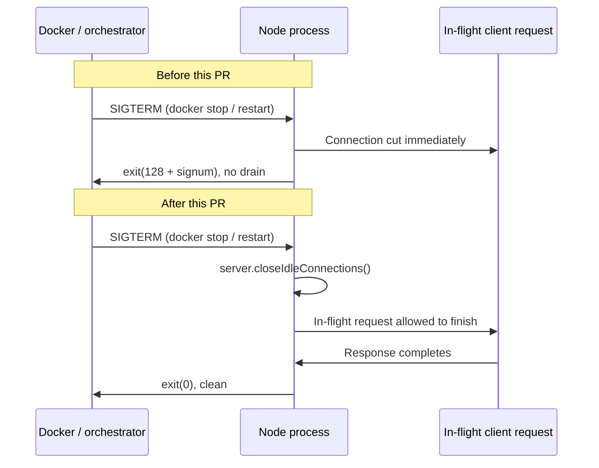
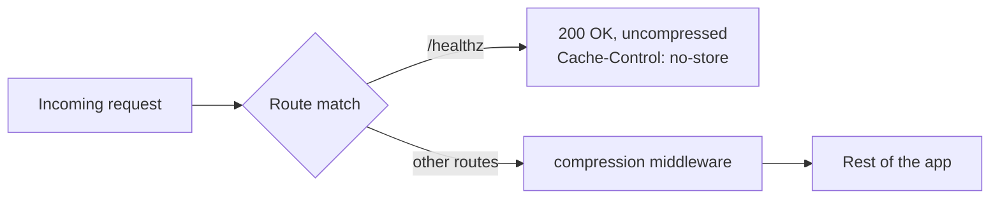
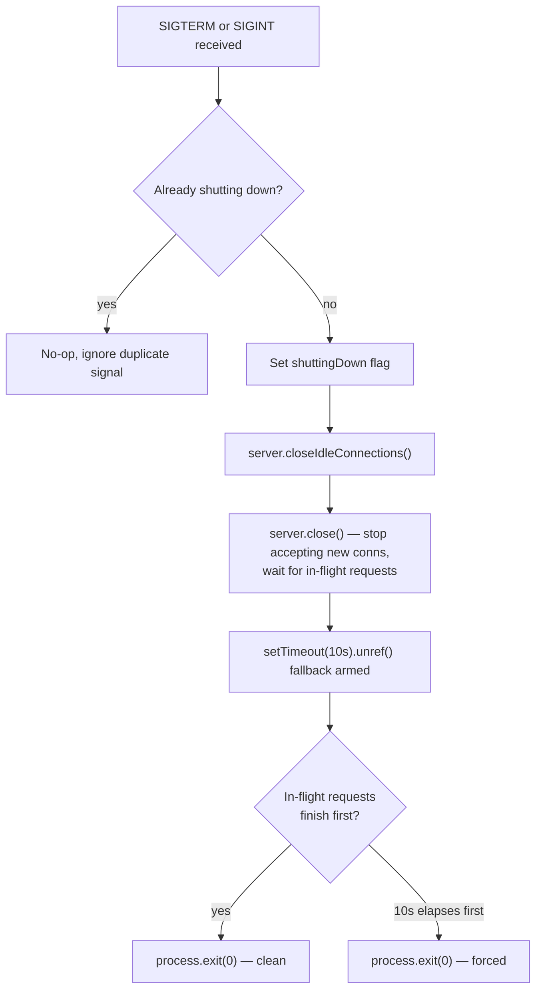
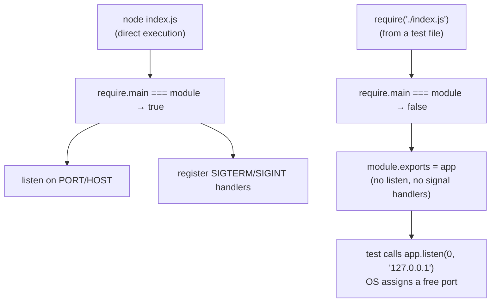
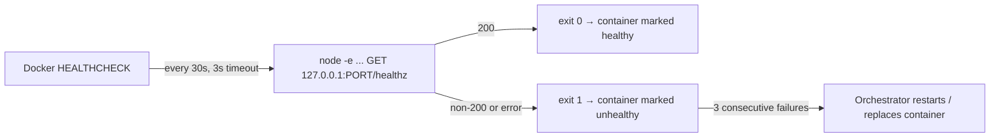

# Week 10 Progress Report by Sonal Gaud

**Project:** Automated Release Pipeline for Music Blocks  
**Mentors:** [Walter Bender](https://github.com/walterbender), [Om Santosh Suneri](https://github.com/omsuneri)  
**Organization:** [Sugar Labs](https://sugarlabs.org)  
**Reporting Period:** 2026-07-27 - 2026-08-02  

---

## Overview

[Week 9](/news/all/2026-07-26-gsoc-26-sonal-gaud-week9) landed release-please: a standing `chore(release): vX.Y.Z` pull request, a corrected version baseline, a seeded changelog anchored at the adoption commit, and a `commit-search-depth` raised from 500 to 3000 so a future release cannot silently truncate. That closed out the versioning half of the release pipeline. This week picked up exactly where that post's "Plans for Next Week" left off: the server side, specifically the `/healthz` liveness endpoint and graceful shutdown work that had been paused during the release-automation detour.

The result is [sugarlabs/musicblocks#7962, "feat: add health endpoint and graceful shutdown"](https://github.com/sugarlabs/musicblocks/pull/7962), currently open, from branch `sonalgaud12:healthz`, with 204 additions and 13 deletions across 5 files. This post documents what it does and, more importantly, why the server needed this at all.

---

## The Problem: `docker stop` Cuts Requests Mid-Flight

`dockerfile` runs `node index.js` as the production entrypoint. Node has a default handler for `SIGTERM`: it exits immediately, with exit code `128 + signum`, and does not drain anything first. Every time a container running this image is stopped or restarted, whatever request happened to be in flight at that instant is simply cut off.

There is a second, related gap: nothing distinguishes "the container process is running" from "the server is actually serving requests." Docker and any orchestrator sitting in front of it (Kubernetes, ECS, a load balancer's health probe) need a positive signal for the second condition, not just the first. Without one, a container that has started but has not finished initializing, or one whose event loop has wedged, looks identical to a healthy one from the outside.



Both problems are solved by the same PR: graceful shutdown fixes the first, `/healthz` fixes the second.

---

## The Endpoint: `GET /healthz`

The route returns HTTP 200 with a small JSON body:

```json
{
  "status": "ok",
  "version": "3.7.1",
  "env": "development",
  "uptime": 42.118273
}
```

served with `Cache-Control: no-store`, so a health probe can never be answered from a stale cache. The version field reads from `package.json`, which means it automatically reflects whatever release-please last bumped it to. This ties directly back to last week: `/healthz` reporting a correct version depends on the manifest being a truthful number in the first place, and the entire point of Week 9's `package.json` fix (`3.4.1 → 3.7.1`) was to make that number trustworthy before anything downstream, including this endpoint, started reading it.

**Route placement matters here in a way it did not for `releaseconfig.js`.** `/healthz` is registered before the `compression` middleware. If it were registered after, every probe response, tiny as it is, would go through gzip/deflate negotiation for no benefit, adding CPU work to a check that is supposed to be cheap and frequent by design (Docker's default probe interval is short, and orchestrators poll continuously). Registering it first means the health check is answered before compression ever gets involved.



---

## Graceful Shutdown: Two Layers, One Guard

The shutdown handler does three things, in order, when `SIGTERM` or `SIGINT` arrives:

1. **`server.closeIdleConnections()`** — immediately closes any keep-alive connections that are not currently mid-request. There is no reason to wait on a connection that is not doing anything.
2. **`server.close()`** — stops accepting new connections and waits for connections that *are* mid-request to finish naturally.
3. **A 10-second `unref()`'d fallback timer** — if something is still open after 10 seconds (a stuck upstream, a hung request), the process exits anyway rather than waiting forever. `unref()` means this timer itself never keeps the process alive; it only acts as a ceiling.



The `B: already shutting down?` guard exists because a person can send the shutdown signal twice, most commonly by pressing Ctrl+C a second time out of impatience while waiting for a clean exit. Without the guard, the second signal would re-enter the same close logic on a server object that is already mid-close, which is exactly the kind of double-invocation bug that is easy to write and annoying to debug later. A single module-level `shuttingDown` boolean, checked and set before anything else runs, makes the whole handler idempotent.

---

## Making `index.js` Testable Without Side Effects

To test any of this, the test suite needs to start a real server on a real port and send it real signals and requests, rather than mocking Express. That requires `index.js` to export the app, but exporting it naively would mean every file that `require()`s `index.js`, directly or transitively, would immediately try to bind port 3000 and register a fresh pair of signal handlers.

The fix, carried over from the same pattern used elsewhere in this project, is a `require.main === module` guard: the `listen()` call and the `process.on("SIGTERM", ...)` / `process.on("SIGINT", ...)` registrations only run when `index.js` is executed directly, not when it is imported. `module.exports = app` sits outside that guard, so tests can import the bare Express app and bind it to an OS-assigned ephemeral port (`app.listen(0, ...)`) with zero side effects on the real `PORT`, `HOST`, or the process's signal table.



---

## The Docker `HEALTHCHECK`

With `/healthz` in place, the `dockerfile` now declares a `HEALTHCHECK`:

```dockerfile
HEALTHCHECK --interval=30s --timeout=3s --start-period=5s --retries=3 \
  CMD node -e "require('http').get({host:'127.0.0.1',port:process.env.PORT||3000,path:'/healthz'},r=>process.exit(r.statusCode===200?0:1)).on('error',()=>process.exit(1))"
```

Two choices here are worth calling out because they are easy to get wrong:

- **It probes `127.0.0.1`, not `$HOST`.** The server binds `0.0.0.0` inside the container (set via `ENV HOST=0.0.0.0`), but loopback is always the correct address to probe *from inside the same container*, regardless of what `HOST` happens to be configured to. Probing `$HOST` would be probing `0.0.0.0` as a destination, which is not a connectable address the way `127.0.0.1` is.
- **It uses `node -e`, not `curl` or `wget`.** Many minimal or distroless-style base images do not ship either binary, but they already have to ship Node to run the app at all. Using Node's own built-in `http` module for the probe keeps the healthcheck portable across whatever base image the Dockerfile ends up using, without adding an image dependency purely for this check.



---

## A Test-Infrastructure Fix Along the Way

Running the new `js/__tests__/healthz.test.js` under `@jest-environment node` surfaced a pre-existing fragility in `jest.setup.js`. The shared setup file unconditionally mocked `HTMLCanvasElement.prototype.getContext`, which assumes a DOM environment exists. Under the `node` test environment there is no `HTMLCanvasElement` global at all, so the mock setup would throw before the health tests could even run.

The fix guards the mock behind a `typeof HTMLCanvasElement !== "undefined"` check, so it silently no-ops in a non-DOM environment instead of crashing. The same guard pattern was applied to `test/setupTests.js` for `window`/`window.btoa`. This is a small fix, but it matters for the pipeline: it is what makes it possible to have some test files run under `jsdom` (for canvas-heavy UI code) and others under plain `node` (for server code) in the same suite, which the release pipeline will lean on more as server-side coverage grows.

---

## Verification

- `js/__tests__/healthz.test.js`: 5 tests, using Node's built-in `http` module to drive requests against an ephemeral-port server, no new devDependency added.
- Full suite: **204 suites, 7153 tests**, all passing.
- `collectCoverageFrom` globs `js/**` and `planet/js/**` only, so the root-level `index.js` intentionally does not enter the coverage report; this is existing project convention, not something this PR changes.

---

## PR Link

PR: [sugarlabs/musicblocks#7962, "feat: add health endpoint and graceful shutdown"](https://github.com/sugarlabs/musicblocks/pull/7962)

Status: open, awaiting review. Files touched: `index.js`, `dockerfile`, `js/__tests__/healthz.test.js` (new), `jest.setup.js` (new), `test/setupTests.js`.

---

## Plans for Next Week

- Address any review feedback on #7962 and get it merged.
- With `/healthz` live, resume work on the reusable `post-deploy-verify.yml` workflow that curls it against every deployed URL, one of the pieces this endpoint was always meant to unblock.
- Continue lining up the containerization work now that both the version/changelog pipeline (Week 9) and the health/shutdown pipeline (this week) are in place under one repository.

---

## Acknowledgements

Thank you to Walter Bender and Om Santosh Suneri for continued guidance as this server-side work came together.
