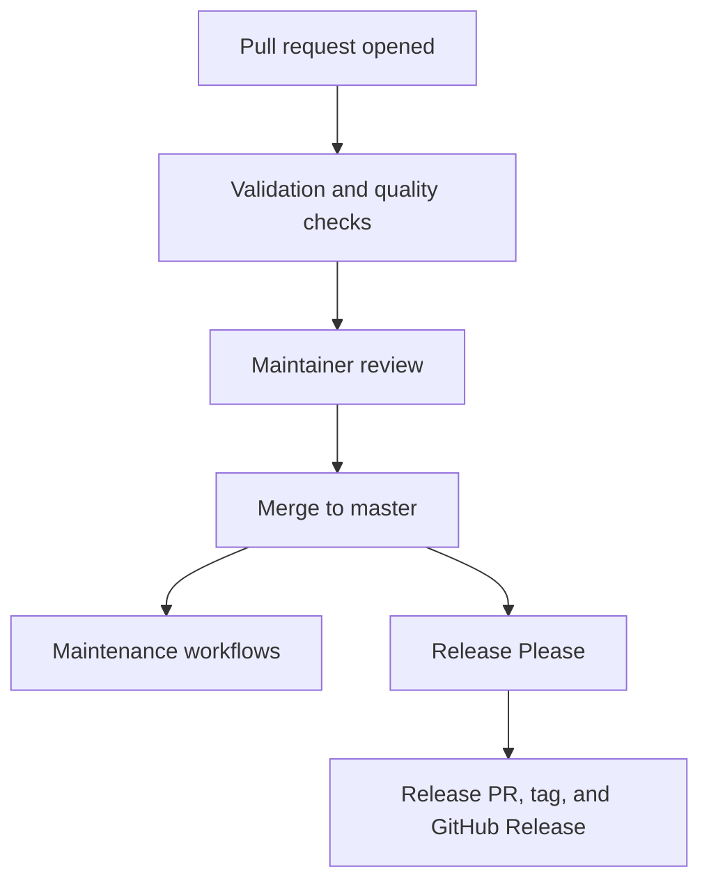

---

title: "GSoC '26 Week 12 Progress Report by Sonal Gaud"
excerpt: "Closing out the release pipeline: GitHub-generated changelog notes for contributor credit, and a full CI/CD architecture writeup for Music Blocks"
category: "DEVELOPER NEWS"
date: "2026-08-16"
slug: "2026-08-16-gsoc-26-sonal-gaud-week12"
author: "@/constants/MarkdownFiles/authors/sonal-gaud.md"
tags: "gsoc26,sugarlabs,musicblocks,ci-cd,release-automation,infrastructure,documentation"
image: "assets/Images/GSOC.webp"

# Week 12 Progress Report by Sonal Gaud

**Project:** Automated Release Pipeline for Music Blocks  
**Mentors:** [Walter Bender](https://github.com/walterbender), [Om Santosh Suneri](https://github.com/omsuneri)  
**Organization:** [Sugar Labs](https://sugarlabs.org)  
**Reporting Period:** 2026-08-10 - 2026-08-16

## Overview

This closing report covers two final deliverables for the automated Music
Blocks release pipeline:

1. Contributor-credit release notes through [PR #8133](https://github.com/sugarlabs/musicblocks/pull/8133), which is now merged.
2. A complete CI/CD architecture document covering pull-request checks,
   maintenance workflows, and release automation.

Together, these changes make the release process more informative and
make the project's automation easier for future contributors to understand.

## Release Notes

Release Please now uses `changelog-type: github`, allowing GitHub's release
notes API to associate release entries with their pull request authors.
The configuration also keeps release notes focused on user-facing changes:
`feat` remains visible, while `fix`, `perf`, `revert`, and `docs` are hidden.
Build, chore, CI, translation, refactor, style, and test changes remain
excluded as before.

Because Release Please uses the rendered notes to decide whether a release
is needed, a series of hidden-only commits will not create a release PR.
This behavior is now documented in `CONTRIBUTING.md`.

The policy is protected by a test in `js/__tests__/releaseconfig.test.js`,
which verifies both GitHub-generated notes and the visible section list.
The release workflow also documents its explicit target branch.

## CI/CD Documentation

The new architecture writeup maps all eleven workflows in the repository,
including PR validation, code quality, DCO, translation checks, Lighthouse,
maintenance, stale-PR handling, and Release Please. It also explains their
triggers, troubleshooting steps, and the security differences between
`pull_request` and `pull_request_target` workflows.

## Verification

- `js/__tests__/releaseconfig.test.js`: 12/12 tests passing.
- `prettier --check`: clean.
- Contributor attribution will be confirmed during an actual GitHub release; the configuration test covers the local policy.

**Files touched:** `release-please-config.json`, `.github/workflows/release-please.yml`, `CONTRIBUTING.md`, and `js/__tests__/releaseconfig.test.js`.

## Acknowledgements

Thank you to Walter Bender and Om Santosh Suneri for their mentorship
throughout the project. Their reviews and attention to edge cases helped
turn the release pipeline into a documented, maintainable system.
of "why it's set up this way" made this a much stronger project than it
would have been otherwise.
