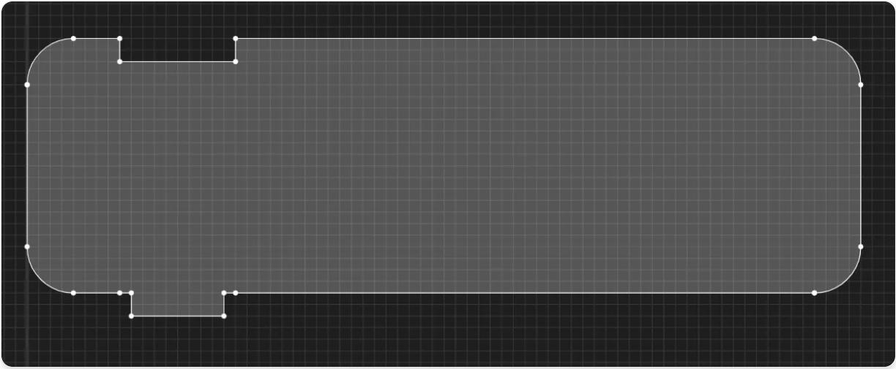
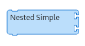

<!-- markdownlint-disable -->

## Final Report

The **Masonry Module** in Music Blocks v4 introduces a modern block-based playground built on a scalable **Model–View** architecture. It replaces older rendering with a system for generating, rendering, and manipulating brick units that represent musical and programming ideas.

**Bricks** can be **stacked, nested, attached, or detached** with fluid **drag-and-drop interactions**, while a **tower model** manages relationships and **collision maps** ensure seamless snapping. This creates an environment that is both playful and structurally accurate, encouraging students to experiment, remix, and reflect on music and code through direct manipulation of interconnected visual elements.

Here is the document which maps out all the technical specifications and functional requirements regarding the Masonry module - [Masonry Tech Spec and Functional Requirements](https://docs.google.com/document/d/1C0t4iSze2eDEv6lWbloK3MnvJgAa6HvmXmk2sQ0lCZs/edit?tab=t.0#heading=h.gtbrgbbwfht3)

## Deliverables

The main objectives of the Masonry Module for Music Blocks v4 were to modernize brick rendering, improve workspace interactions, and create a scalable foundation for visual programming with music. Specifically, the project aimed to:

1. **Implement Dynamic Brick Geometry** : Generate accurate SVG paths and bounding boxes for all brick types (simple, expression, compound), enabling precise rendering and alignment.

2. **Introduce a Model–View Architecture for Bricks**: Establish clean abstractions between brick models and React-based views, ensuring maintainability, extensibility, and testability.

3. **Enable Tower-Based Rendering** : Represent bricks as hierarchical towers with support for stacking, nesting, and argument placement, including utilities for layout and a brick factory.

4. **Provide an Interactive Brick Palette** : Build a categorized, searchable palette that maps brick types to UI components, allowing easy drag-and-drop of bricks into the workspace.

5. **Support Drag-and-Drop with Collision Detection** : Introduce collision maps, reverse mapping, and snapping logic to make brick manipulation smooth, accurate, and intuitive.

6. **Allow Tower Disconnection and Movement** : Enable detaching of brick subtrees into independent towers, supporting dynamic restructuring of programs.

7. **Allow Brick/Tower Connections**: Implement connection logic so bricks and towers can snap together across different structures, enabling larger and more complex program assemblies.

8. **Parse AST from Masonry to Program Module**: Translate brick/tower structures into an Abstract Syntax Tree (AST) consumable by the program execution module, bridging the visual editor with actual program logic.

## Technical Implementation

### Phase 1 : Foundations of Brick Rendering and Architecture

**Related Work:** [#439](https://github.com/sugarlabs/musicblocks-v4/pull/439)

The initial phase focused on giving bricks a precise and scalable visual identity within the Masonry module. Instead of hardcoded shapes, each brick’s geometry was generated dynamically using SVG path logic.

**SVG Path Engine**: Built functions to draw parametric brick outlines, supporting different types (**Simple Statement, Expression, Compound Statement**).

**Customizable Properties**: Allowed brick geometry to adapt to label widths, slot counts, and notch configurations.

**Bounding Boxes**: Computed accurate brick dimensions, ensuring reliable alignment and layout calculations.

**Connection Anchors**: Defined snap points for incoming and outgoing connections, paving the way for future drag-and-drop.

**Testing & Validation**: Verified geometry through unit tests and Storybook visual checks to ensure correctness across cases.

This phase established the geometry backbone of Masonry — making every brick type scalable, flexible, and ready for interaction.

<p align="center">
  
  <br>Simple brick SVG 
</p>

<p align="center">
  
  <br>Expression brick SVG 
</p>

<p align="center">
  
  <br>Compound brick SVG 
</p>

### Phase 2: Model–View Architecture for Bricks

**Related Work:** [#441](https://github.com/sugarlabs/musicblocks-v4/pull/441)

The second phase centered on creating a clean architectural separation between the data that defines a brick and the React components that render it.

**Brick Models**: Introduced abstract and concrete BrickModel classes to encapsulate each brick’s state, properties, slots, and geometry.

**React Views**: Built SimpleBrickView, ExpressionBrickView, and CompoundBrickView components to render bricks based solely on their model data.

**Factory & Registry**: Implemented a factory to create bricks from JSON specifications and a registry to map each brick type to its corresponding model and view.

**State Management**: Defined interaction states (isHovered, isDragged, isSelected, isFolded) directly in models, keeping UI logic consistent across views.

**Testing in Isolation**: Verified functionality using unit tests for models and Storybook examples for views, ensuring reliability and maintainability.

This phase gave Masonry a robust architectural backbone, where models handle logic and views focus purely on presentation enabling future features like towers, palettes, and drag-and-drop to build on a solid foundation

<p align="center">
  
  <br>Simple brick 
</p>

<p align="center">
  
  <br>Expression brick 
</p>

<p align="center">
  
  <br>Compound brick 
</p>

### Phase 3: Tower Rendering System & Tree Model

**Related Work:** [#442](https://github.com/sugarlabs/musicblocks-v4/pull/442)<br>
**Related Work:** [#443](https://github.com/sugarlabs/musicblocks-v4/pull/443)

This phase focused on moving from individual bricks to structured programs by organizing them into hierarchical towers. The goal was to create a representation that could capture stacking, nesting, and expression slots in a unified way, while rendering them consistently.

**Tree Model (Program Hierarchy)** - Introduced a rooted tree data structure to represent towers, where each brick knows its parent and children.

Supported hierarchical structures including:

- **Stacked statements** (vertical sequences).

- **Expression slots** (inline attachments).

- **Compound bricks** (blocks with inner lanes like body or else).

Provided traversal and manipulation methods for adding, removing, and reordering nodes.

**Tower Rendering (Deterministic Layout)** - Implemented layout rules to position bricks from their bounding boxes, ensuring correct stacking, inline expression placement, and lane alignment with consistent spacing across all structures.

**Verification** - Used Storybook to render example towers (flat stacks, nested structures, and expression-in-compound combinations) for visual validation.

<p align="center">
  
  <br>Interactive Tower 1
</p>

### Phase 4: Palette, Drag-and-Drop & Collision Detection

**Related Work:** [#444](https://github.com/sugarlabs/musicblocks-v4/pull/444)<br>
**Related Work:** [#447](https://github.com/sugarlabs/musicblocks-v4/pull/447)

This phase focused on making Masonry interactive by giving learners a palette to select bricks, supporting drag-and-drop into the workspace, and introducing collision detection to guide snapping behavior.

**Interactive Palette**: Built a categorized, searchable palette linked to the brick registry, allowing users to drag bricks into the workspace as new towers.

**Drag-and-Drop System**: Implemented pointer event handling using Recoil so bricks could be picked, dragged, and dropped into functional towers.

**Collision Detection & Snapping**: Introduced collision maps to track incoming connection points of towers and implemented reverse mapping to resolve which brick and tower a collision point belongs to.

**Verification** - Initialized a playground to test the palette and dragging and dropping of bricks from the palette to the workspace.

<p align="center">
  <video src="../../../../public/assets/Images/Palette-drag&drop.mp4" controls width="500px"></video>
  <br>Palette Drag & Drop Demo
</p>

<p align="center">
  <video src="../../../../public/assets/Images/collision-detection.mp4" controls width="500px"></video>
  <br>Collision Map
</p>

### Phase 5: Tower Disconnection & Movement

**Related Work:** [#450](https://github.com/sugarlabs/musicblocks-v4/pull/450)

**Subtree Detachment**: Implemented logic to detach a brick and its descendants into a new tower without breaking structure.

**Independent Movement**: Allowed disconnected towers to be repositioned and dragged independently within the workspace.

**Tower Updates**: Ensured tower models update relationships and bounding boxes correctly when subtrees are removed or moved.

**Verification:** Validated by detaching and re-arranging towers of different types in the workspace.

<p align="center">
  <video src="../../../../public/assets/Images/brick-disconnection.mp4" controls width="500px"></video>
  <br>Brick Disconnection
</p>

### Phase 6: Brick Connections & AST Parsing

**Related Work:** [Week 9](https://github.com/sugarlabs/musicblocks-v4/tree/gsoc-dmp-2025/week-9/justin)<br>
**Related Work:** [Week 10-12](https://github.com/sugarlabs/musicblocks-v4/tree/gsoc-dmp-2025/week-10-12)

**Tower Connections**: Implemented logic to snap bricks and towers together across structures, merging hierarchies while preserving alignment and execution order.

**Stable Brick IDs**: Assigned each brick a unique, consistent ID so Masonry and the Program module reference the same nodes.

**Shared Registry**: Unified brick definitions (form, sockets, props, AST mapping) to ensure one source of truth between Masonry and the Program.

**Validation Layer**: Added checks to confirm node types exist, sockets are valid, and structures are well-formed before execution.

**Tree to AST Translation**: Converted towers into ASTs deterministically, keeping IDs intact, mapping props, and placing children in correct sockets.

**Execution Flow**: Ran compiled IR through the Program scheduler, linking visual bricks directly to executable program logic.

This phase fully bridged the Masonry editor with the Program module, enabling towers of connected bricks to be parsed into ASTs and executed as live music and code.

```typescript
function loadTower(towerPath: string): {
  tree?: BrickTree;
  errors?: LoadError[];
} {
  const raw = fs.readFileSync(towerPath, "utf8");
  let tower: BrickTree;
  try {
    tower = JSON.parse(raw);
  } catch (e) {
    return { errors: [{ brickId: "", reason: "Invalid JSON" }] };
  }

  const errors: LoadError[] = [];
  const ids = Object.keys(tower.nodes);
  const idSet = new Set<string>();

  // Check every nodes[k].id === k and is a string
  for (const k of ids) {
    const node = tower.nodes[k];
    if (!node) {
      errors.push({ brickId: k, reason: "Node missing" });
      continue;
    }
    if (typeof node.id !== "string" || !node.id.length) {
      errors.push({ brickId: k, reason: "id is not a non-empty string" });
      continue;
    }
    if (node.id !== k) {
      errors.push({
        brickId: k,
        reason: `id mismatch: node.id=${node.id} key=${k}`,
      });
      continue;
    }
    if (idSet.has(node.id)) {
      errors.push({ brickId: k, reason: "Duplicate id" });
      continue;
    }
    idSet.add(node.id);
  }

  // Check root exists
  if (!tower.nodes[tower.root]) {
    errors.push({ brickId: tower.root, reason: "Root node missing" });
  }
  // ...existing code...
}
```

<p align="center">
  </img>
  <br> UML Diagram for brick/tower connections
</p>

## Project Timeline

## Timeline

| Week    | Dates                   | Milestones & Achievements                                                                                                                        | Blog / Report Link                                                                            |
| ------- | ----------------------- | ------------------------------------------------------------------------------------------------------------------------------------------------ | --------------------------------------------------------------------------------------------- |
| Week 1  | 2025-06-01 – 2025-06-07 | Set up local environment for Music Blocks v4, studied existing brick logic, and began designing a scalable SVG-based brick path system.          | [Week 1](https://www.sugarlabs.org/news/developer-news/2025-06-09-dmp-25-justin212407-week01) |
| Week 2  | 2025-06-08 – 2025-06-14 | Implemented dynamic brick geometry with SVG paths, bounding boxes, and anchors for Simple, Expression, and Compound bricks.                      | [Week 2](https://www.sugarlabs.org/news/developer-news/2025-06-15-dmp-25-justin212407-week02) |
| Week 3  | 2025-06-15 – 2025-06-21 | Established the Model–View architecture by introducing BrickModels, React views, and a registry for clean separation of logic and rendering.     | [Week 3](https://www.sugarlabs.org/news/developer-news/2025-06-22-dmp-25-justin212407-week03) |
| Week 4  | 2025-06-22 – 2025-06-28 | Built the tower system and tree model to represent stacked, nested, and expression-linked bricks with deterministic layout rules.                | [Week 4](https://www.sugarlabs.org/news/developer-news/2025-06-29-dmp-25-justin212407-week04) |
| Week 5  | 2025-06-29 – 2025-07-05 | Developed the interactive brick palette with categories and search, enabling drag of new bricks from palette into the workspace.                 | [Week 5](https://www.sugarlabs.org/news/developer-news/2025-07-06-dmp-25-justin212407-week05) |
| Week 6  | 2025-07-06 – 2025-07-12 | Integrated drag-and-drop in the workspace, added collision maps and snapping behavior for aligning towers and bricks.                            | [Week 6](https://www.sugarlabs.org/news/developer-news/2025-07-13-dmp-25-justin212407-week06) |
| Week 7  | 2025-07-13 – 2025-07-20 | Implemented tower disconnection logic so subtrees could be detached into new towers and moved independently.                                     | [Week 7](https://www.sugarlabs.org/news/developer-news/2025-07-20-dmp-25-justin212407-week07) |
| Week 8  | 2025-07-21 – 2025-07-27 | Extended functionality with tower connection handling, enabling independent structures to snap and merge correctly.                              | [Week 8](https://www.sugarlabs.org/news/developer-news/2025-07-27-dmp-25-justin212407-week08) |
| Week 9  | 2025-07-28 – 2025-08-03 | Finalized brick/tower connection logic with reverse mapping, ensuring robust snapping and validated structure when merging towers.               | [Week 9](https://www.sugarlabs.org/news/developer-news/2025-07-27-dmp-25-justin212407-week09)                                                                                   |
| Week 10 | 2025-08-04 – 2025-08-10 | Wrote documentation for Masonry’s architecture and pipeline, covering models, views, towers, and interactions for future contributors.           | [Week 10](https://www.sugarlabs.org/news/developer-news/2025-07-27-dmp-25-justin212407-week10)                                                                                  |
| Week 11 - 12 | 2025-08-11 – 2025-08-17 | Conducted integration testing of Masonry’s end-to-end flow, added plugin registration checks, AST parsing pipeline: translating towers into validated ASTs . | [Week 11-12](#)                                                                                                                       |

## Learning and Acknowledgements

### Key Learnings

- **Phase 1 (Dynamic Brick Generation)**: Learned how to build a parametric SVG path system with accurate bounding boxes and anchors for flexible brick rendering.

- **Phase 2 (Model–View Architecture)**: Understood how separating data models from React views creates a scalable and maintainable design.

- **Phase 3 (Tower Rendering & Tree Model)**: Learned to represent programs as hierarchical trees and apply deterministic layout rules for stacked, nested, and expression bricks.

- **Phase 4 (Palette, Drag-and-Drop & Collision Detection)**: Gained experience integrating searchable palettes, drag-and-drop interactions, and collision maps for smooth snapping.

- **Phase 5 (Tower Disconnection & Movement)**: Learned how to implement dynamic subtree detachment and movement while keeping tower relationships consistent.

- **Phase 6 (Brick Connections & AST Parsing)**: Understood how to bridge visual bricks with compiler logic using stable IDs, shared registries, validation, and deterministic AST translation.

### Future Plans

- **Expand Bricks**: Add more advanced musical and computational bricks while ensuring they integrate seamlessly into the AST pipeline.

- **Improve Snap & Collision Logic**: Refine snapping behavior with performance-focused algorithms like quadtrees for larger programs.

- **Cross-Module Integration**: Strengthen the link between Masonry and the execution environment, ensuring smooth AST → IR → runtime transitions.

### Acknowledgments

I would like to extend my heartfelt thanks to:

- **Anindya Kundu & Walter Bender**: For their continuous mentorship, guidance, and insightful feedback throughout the project.

- **Sugar Labs Community**: For their support, discussions, and encouragement that shaped the Masonry module into a robust system.

- **Open Source Tools & Libraries**: React, TypeScript, Storybook, Jest, and other open-source resources that made development efficient.

Their support was invaluable in making the Masonry module for Music Blocks v4 a successful and educational experience. Overall, Code 4 GovTech DMP 2025 was a great learning experience for me.